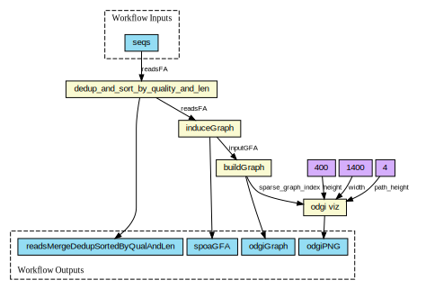

Demo CWL workflow



Generate graph genome (with visualization) from a set of sequences using `spoa` and `odgi`.

Sample data set of 100 SARS-CoV-2 viral genomes, from [PubSeq](http://covid-19.genenetwork.org/)

```
cwl-runner pangenome-generate_spoa.cwl pubseq.yml
```

Interoperability demo

|Software|Logs|
|--------|-----------|
|cwltool|[Example run](logs/cwltool.log)|
|Arvados|[Example run](https://workbench.lugli.arvadosapi.com/container_requests/lugli-xvhdp-bhsestl25hm82p5) / [Results](https://workbench.lugli.arvadosapi.com/collections/lugli-4zz18-slfh7i3ogck04a8)|
|Toil|[Example run](logs/toil.log)|
